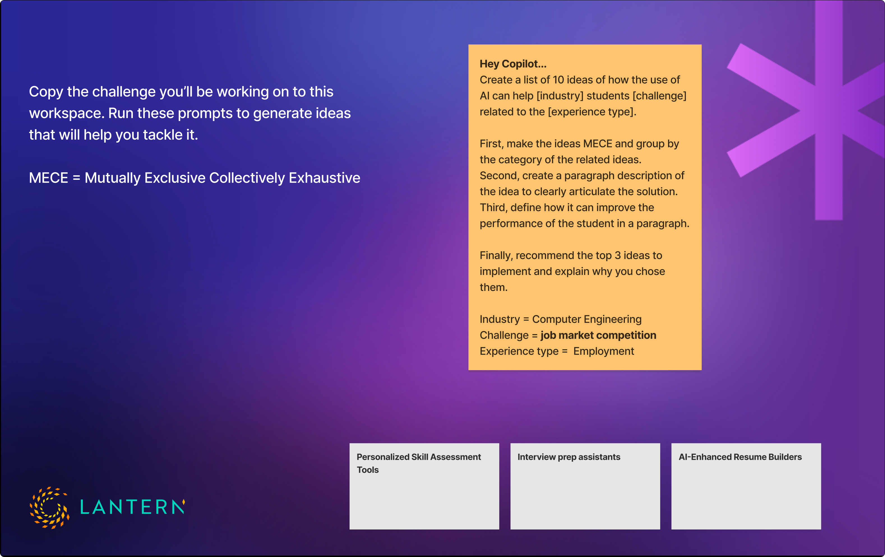
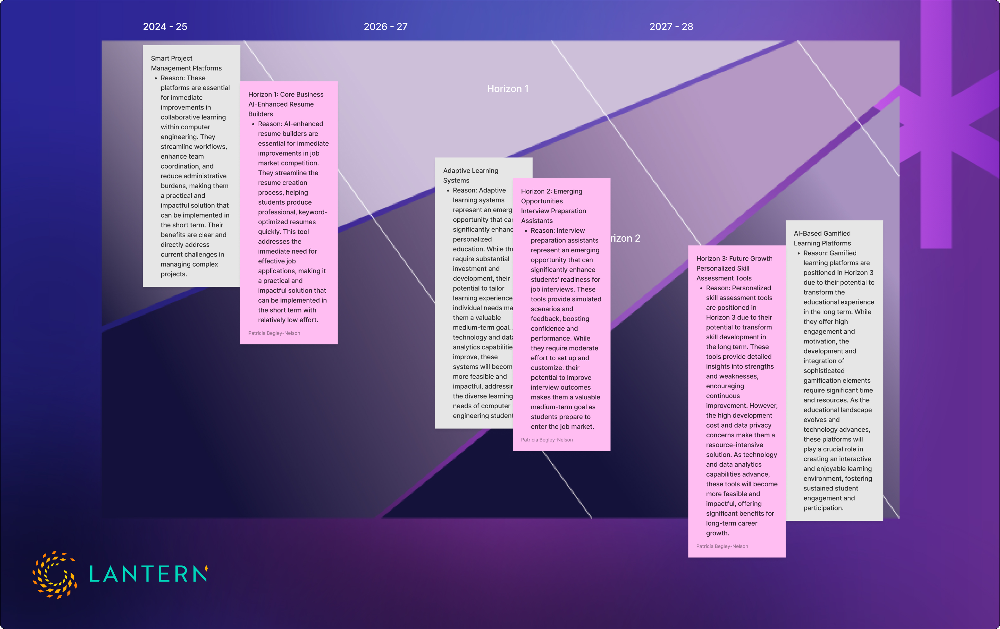

## Guiding Computer Science Students in AI-Driven Problem Solving

As part of an interactive session, I had the opportunity to work with a group of about 20 computer science students, utilizing Microsoft CoPilot to explore problem-solving through AI-driven prompts. Rather than simply providing answers, we allowed the students to guide the direction of their exploration, fostering critical thinking and decision-making (this workshop was designed by a colleague and created successful outcomes from our clients).

When given the choice, the group identified three key areas of interest:

1. Collaborative Learning
2. Practical Application of Theoretical Knowledge
3. Job Market Competition

From these, they unanimously decided to tackle Job Market Competition first.

The students were eager to understand the biggest challenges they would face in the job market, so we started by prompting CoPilot to generate a list of the top 10 challenges. As we refined and categorized the responses, they quickly saw how AI can help generate ideas—but not necessarily solutions. This distinction became an important learning moment: AI can be a powerful tool for ideation, but human insight is still crucial for refining and applying those ideas effectively.

### Approach

AI as Augmented Intelligence, Not a Replacement

_Here’s where I took a moment to step onto my soapbox._

AI, when viewed as Augmented Intelligence (a term coined by Greg Nudelman), serves as a starting point—a brainstorming assistant, an additional perspective—not a replacement for human creativity and judgment. I emphasized this throughout the session, reinforcing that while AI can accelerate ideation, it cannot replace the critical thinking and intuition that real problem-solving requires.

From Ideas to Actionable Strategies

With this mindset in place, we moved forward with:

1. Impact/Effort Matrix – Students mapped out AI-generated insights onto this matrix to identify quick wins (low-hanging fruit) and more challenging, high-impact areas. This helped them see where they could start taking actionable steps in their job market preparation.
2. McKinsey 3 Horizon Framework – Using this business growth strategy model, we created a roadmap that allowed students to think long-term about how they could position themselves for career success. This framework provided structure to their learning, showing how short-term actions could build towards broader, strategic goals.

<figure>
	
</figure>

### Outcome

After working through these exercises, we opened the floor for Q&A. The most common questions? How do we use AI in our daily work, and how do we avoid hallucinations?

Again, my response echoed my earlier message: AI is a tool, not an infallible oracle. Critical thinking remains key—users must validate information, cross-check sources, and ensure AI outputs align with real-world logic.

The session ended on a high note, with great feedback from students and an invitation to return in 2025. The experience reaffirmed the importance of teaching AI literacy alongside technical skills, ensuring the next generation understands not just how to use AI, but how to think critically about it.

<figure>
	
</figure>
